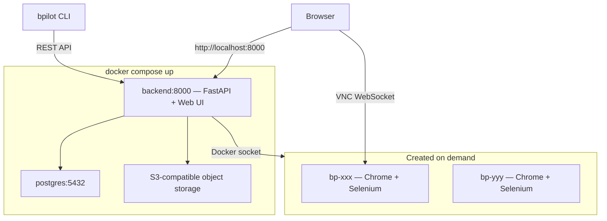

[中文](README.zh.md)

# browser-pilot

Remote browser automation for AI Agents. Each session runs in an isolated Docker container with Chrome, Selenium, anti-bot stealth, and a noVNC viewer — controllable via REST API, CLI, or the built-in web UI.


## Quick Start

Requires **Docker** (with Compose v2).

```bash
git clone https://github.com/NoDeskAI/browser-pilot.git
cd browser-pilot

cp .env.example .env
# Edit passwords before production/public deployment.

# Build all images and start services
docker compose build && docker compose up -d
```

Open **[http://localhost:8000](http://localhost:8000)** — you'll see the web UI with session management and a live browser viewer (noVNC).


### Apple Silicon / ARM users

Before building, create a `.env` file:

```bash
echo 'SELENIUM_BASE_IMAGE=seleniarm/standalone-chromium:latest' > .env
```

## CLI

Install the zero-dependency `bpilot` command-line tool served by the Browser Pilot backend to drive the browser from your terminal or integrate with external Agent frameworks like OpenClaw. The web UI includes a **CLI Access** button that generates a ready-to-paste command reference for humans or AI agents.


```bash
curl -fsSL http://localhost:8000/api/cli/install | bash
```

Configure and use:

```bash
bpilot config set api-url http://localhost:8000

bpilot network-egress list --json
bpilot network-egress create --name "Office" --type clash --config-file ./clash.yaml

bpilot session create --name "My Task" --network-egress direct
bpilot session use <session-id>
bpilot --session <session-id> session set-network <egress-id|direct>
bpilot session delete <session-id>  # delete session; completed files are kept in Files by default
bpilot session delete <session-id> --delete-files # also delete all completed files

bpilot navigate https://example.com
bpilot observe                    # see page elements with coordinates
bpilot click 640 380              # click at coordinates
bpilot type "hello world"         # type into focused input
bpilot screenshot                 # store screenshot and print a signed file.url
bpilot screenshot --output page.png # stored in FileStore, then exported locally
bpilot files list --json          # list session files with status
bpilot files upload ./input.csv   # upload a local file into the session
bpilot files get <file-id> -o out.csv # save a completed session file locally
bpilot files rename <file-id> final.csv
bpilot files delete <file-id>
```

Add `--json` for machine-readable output (for AI Agents). Use `bpilot session list --json` to inspect each session's `networkEgress*` fields. Use `bpilot files list --json` to inspect session files; each item includes `status` so agents can distinguish in-progress files from `completed` files.

## Architecture




Each browser session gets its own Docker container with:

- Isolated Chrome instance with anti-bot stealth (fingerprint spoofing, human-like input patterns)
- Selenium WebDriver for automation
- noVNC (port 7900) for live viewing
- CDP event logger for debugging
- **Device presets**: Switch between desktop resolutions (1920×1080 to 1280×720) and mobile device emulation (iPhone, iPad, Galaxy, Pixel) with automatic UA and viewport switching
- **Network egress profiles**: Route sessions through Direct, Clash, or OpenVPN exits, changeable at any time in the UI

## Development

For local development without Docker for the backend:

```bash
cp .env.example .env
# Edit database credentials before production/public deployment.
# ARM users: uncomment SELENIUM_BASE_IMAGE.

./start.sh          # foreground mode (Ctrl+C to stop)
./start.sh -d       # background daemon mode
./start.sh stop     # stop background processes
./start.sh status   # check process status
```

This starts PostgreSQL and bundled S3-compatible object storage in Docker, initializes the default bucket, builds the Selenium image, and runs the backend (uvicorn, port 8000) + frontend dev server (Vite, port 9874) on the host.

## Configuration


| Variable              | Default                                                        | Description                                                                                                                        |
| --------------------- | -------------------------------------------------------------- | ---------------------------------------------------------------------------------------------------------------------------------- |
| `DATABASE_URL`        | Required in `.env`; see `.env.example`                         | PostgreSQL connection string for local backend development. Keep it aligned with `POSTGRES_*`.                                     |
| `POSTGRES_USER`       | Required in `.env`; see `.env.example`                         | PostgreSQL user used by Docker Compose and local development.                                                                      |
| `POSTGRES_PASSWORD`   | Required in `.env`; see `.env.example`                         | PostgreSQL password. Change it before production/public deployment.                                                                |
| `POSTGRES_DB`         | Required in `.env`; see `.env.example`                         | PostgreSQL database name.                                                                                                         |
| `MINIO_ROOT_USER`     | Required in `.env`; see `.env.example`                         | Root user for the bundled S3-compatible storage service.                                                                           |
| `MINIO_ROOT_PASSWORD` | Required in `.env`; see `.env.example`                         | Root password for the bundled S3-compatible storage service. Change it before production/public deployment.                       |
| `MINIO_BUCKET`        | Required in `.env`; see `.env.example`                         | Bucket created automatically by Docker Compose and preconfigured as the default S3 storage bucket.                                |
| `MINIO_ENDPOINT`      | `http://localhost:9000` for `start.sh`; container-internal endpoint in Docker Compose | Endpoint used by the backend to reach the bundled S3-compatible storage service.                                      |
| `MINIO_PUBLIC_ENDPOINT` | `http://localhost:9000` in Docker Compose                    | Public endpoint embedded in S3 signed download URLs. It must be reachable by browsers and CLI clients.                            |
| `SELENIUM_BASE_IMAGE` | `selenium/standalone-chrome:latest`                            | Base image for browser containers. ARM users: `seleniarm/standalone-chromium:latest`                                               |
| `DOCKER_HOST_ADDR`    | `localhost`                                                    | How the backend reaches browser containers. Set to `host.docker.internal` in Docker deployment (auto-configured by docker-compose) |
| `BROWSER_RUNTIME_BACKEND_URL` | `http://host.docker.internal:8000` | Backend URL injected into browser runtime agents for internal file ingest callbacks. |
| `BP_LEGACY_DOCKER_DOWNLOAD_WATCHER` | `false` | Temporary fallback for old Selenium images without `file-capture-agent`. When enabled, backend uses Docker copy commands and reports a degraded warning. |
| `OPENAI_API_KEY`      | —                                                              | Optional. When set, uses LLM to auto-name sessions on first navigation. Without it, sessions are named by page title.              |
| `LOG_LEVEL`           | `INFO`                                                         | Backend log verbosity. Set to `DEBUG` for troubleshooting.                                                                         |
| `JWT_EXPIRE_MINUTES`  | `30`                                                           | Short-lived access JWT lifetime in minutes.                                                                                       |
| `REMEMBER_ME_DAYS`    | `7`                                                            | Duration for the revocable remember-me cookie used to restore short-lived access tokens.                                           |
| `NETWORK_EGRESS_DOCKER_NETWORK` | `browser-pilot-net` | Docker bridge network used by browser containers and managed egress containers. |
| `NETWORK_EGRESS_CONFIG_DIR` | `data/network-egress` | Private config storage for managed Clash/OpenVPN egress profiles. |
| `NETWORK_EGRESS_CLASH_IMAGE` | `ghcr.io/metacubex/mihomo:latest` | Container image used for managed Clash egress profiles. |
| `NETWORK_EGRESS_CLASH_PROXY_PORT` | `7890` | Proxy port exposed by managed Clash containers on the internal Docker network. |
| `NETWORK_EGRESS_OPENVPN_IMAGE` | `browser-pilot-openvpn-egress:latest` | Container image used for managed OpenVPN egress profiles. The default image is built from `services/network-egress-openvpn` on first use. |
| `NETWORK_EGRESS_OPENVPN_PROXY_PORT` | `8888` | HTTP proxy port exposed by managed OpenVPN containers on the internal Docker network. |

### File storage

Docker Compose starts a bundled S3-compatible object storage service and preconfigures it as regular S3 storage on first backend startup. The storage settings page still only exposes two modes: **S3 Storage** and **Built-in Storage**. To use AWS S3, Cloudflare R2, OSS, or another S3-compatible provider, edit the S3 fields in the settings page; existing database settings are never overwritten by the Compose defaults.

Browser downloads are captured inside the Selenium/Chrome runtime by `file-capture-agent`. The agent listens to Chrome download completion events and uploads finished files to the backend ingest API; storage provider credentials stay only in the backend. The older backend Docker watcher is disabled by default and should only be enabled temporarily for old browser images that do not contain the runtime agent.

Session files are managed through the backend FileStore. Users and session-scoped API tokens can list, upload, read, rename, and delete active session files through `/api/sessions/{sessionId}/files`; delete responses distinguish backend object deletion from file-list record deletion. When a session is deleted, completed files are either archived into the global Files page or explicitly deleted by the user. User-level tokens can manage global files through `/api/files`; session-scoped tokens cannot access global file management or request archived file URLs. File DTOs return 15-minute signed download URLs: Built-in storage uses signed backend `/api/files/...` URLs, while S3 storage returns S3 pre-signed URLs generated by the backend. S3 credentials remain backend-only.

### Database migrations

Browser Pilot runs Alembic migrations automatically when the backend starts. Normal upgrades only require restarting the new version; users do not need to run migration commands manually.

If migration fails, the backend keeps `/healthz` alive but reports `/readyz` as unavailable and the frontend shows the database update error. Downgrades do not automatically roll back schema changes; use an app version compatible with the current database or restore a matching backup.

### Network Egress

Browser Pilot can route a session through a deployment-side egress profile from **Settings > Network Egress**:

- `Direct`: no browser proxy, current default behavior.
- `Clash`: run a managed Clash-compatible container and point browser sessions at its internal proxy port.
- `OpenVPN`: run a managed OpenVPN container with an HTTP proxy wrapper. This mode requires the Docker host to allow `/dev/net/tun` and `NET_ADMIN`.

Egress profiles are deployment-side. They do not automatically reuse a VPN already connected on a user's laptop unless that VPN configuration is also available to this deployment.
| `BP_VISION_BACKEND`   | `yolo`                                                         | Vision observe backend. The default uses a YOLOv8 UI detector weight. Use `omniparser` to parse screenshots with Microsoft OmniParser. |
| `BP_UI_DETECTOR_MODEL` | —                                                             | Optional absolute path to the YOLOv8 UI detector weight. If unset, Browser Pilot looks for `backend/models/noah-real-yolov8n-ui.pt`. |
| `BP_OMNIPARSER_URL`   | —                                                              | Optional OmniParser server URL, for example `http://127.0.0.1:8001`. The backend calls `POST /parse/`.                             |
| `BP_OMNIPARSER_REPO`  | —                                                              | Optional local OmniParser repo path when not using a server. Requires OmniParser requirements and weights installed separately.     |


### Default YOLO vision backend

`observe --mode vision` uses a YOLOv8 UI detector by default. Model weights are not vendored in this repository. On startup/use, Browser Pilot checks whether the weight exists locally and returns a download hint if it is missing.

Recommended local install:

```bash
mkdir -p backend/models
curl -L \
  -o backend/models/noah-real-yolov8n-ui.pt \
  https://huggingface.co/Noah03064515s22/yolov8-ui-detection-models/resolve/main/models/real_yolov8n.pt
```

Alternatively set:

```bash
export BP_UI_DETECTOR_MODEL=/absolute/path/to/noah-real-yolov8n-ui.pt
```

`observe --mode mix` first returns DOM results. Vision inference is only used as a fallback when DOM observe returns no elements.

### OmniParser vision backend

`observe --mode vision` and `observe --mode mix` can use Microsoft OmniParser V2:

```bash
export BP_VISION_BACKEND=omniparser

# Option A: connect to a separate OmniParser server
export BP_OMNIPARSER_URL=http://127.0.0.1:8001

# Option B: load a local OmniParser clone and weights
export BP_OMNIPARSER_REPO=/path/to/OmniParser
```

Example OmniParser server launch from an upstream clone:

```bash
cd /path/to/OmniParser/omnitool/omniparserserver
python omniparserserver.py \
  --host 127.0.0.1 \
  --port 8001 \
  --device cpu \
  --som_model_path ../../weights/icon_detect/model.pt \
  --caption_model_name florence2 \
  --caption_model_path ../../weights/icon_caption_florence \
  --BOX_TRESHOLD 0.05
```

OmniParser code and weights are not vendored in this repository. Check the OmniParser model licenses before redistribution; its icon detection weights inherit the YOLO license noted by the upstream project.

## Security

The Docker Compose deployment mounts `/var/run/docker.sock` into the backend container, giving it full control over the host Docker daemon. **Do not expose this service on untrusted networks.** Use a reverse proxy with authentication if deploying remotely.

## License

Apache License 2.0 — see [LICENSE](LICENSE).
