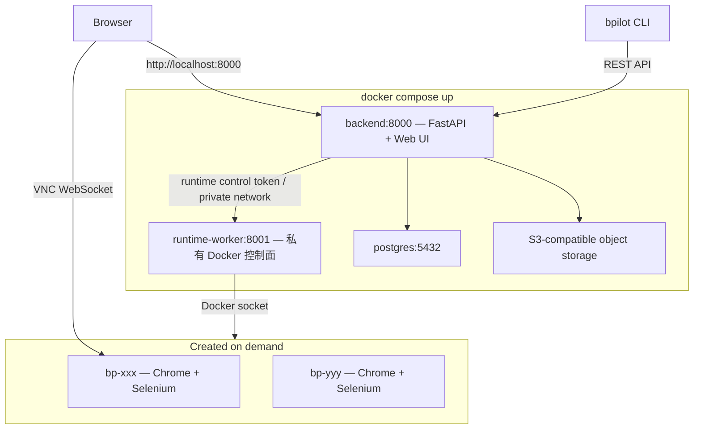

[English](README.md)

# browser-pilot

面向 AI Agent 的远程浏览器自动化。每个会话运行在独立的 Docker 容器中，内置 Chrome、Selenium、反检测隐身机制和 noVNC 查看器 — 可通过 REST API、CLI 或内置 Web UI 控制。


## 快速开始

需要 **Docker**（含 Compose v2）。

```bash
git clone https://github.com/NoDeskAI/browser-pilot.git
cd browser-pilot

# 构建镜像并启动服务
docker compose build && docker compose up -d
```

打开 **[http://localhost:8000](http://localhost:8000)** — 即可看到带会话管理和实时浏览器查看器（noVNC）的 Web UI。


### Apple Silicon / ARM 用户

构建前先创建 `.env` 文件：

```bash
echo 'SELENIUM_BASE_IMAGE=seleniarm/standalone-chromium:latest' > .env
```

## 命令行工具

安装由 Browser Pilot 后端提供的零依赖 `bpilot` 命令行工具，可以从终端驱动浏览器，也可以对接 OpenClaw 等外部 Agent 框架。Web UI 中有一个 **CLI Access** 按钮，可一键生成面向人类或 AI Agent 的 CLI 接入文档。


```bash
curl -fsSL http://localhost:8000/api/cli/install | bash
```

配置并使用：

```bash
bpilot config set api-url http://localhost:8000

bpilot network-egress list --json
bpilot network-egress create --name "Office" --type clash --config-file ./clash.yaml

bpilot session create --name "My Task" --network-egress direct
bpilot session use <session-id>
bpilot --session <session-id> session set-network <egress-id|direct>
bpilot session delete <session-id>  # 删除会话；已完成文件默认保留到文件页
bpilot session delete <session-id> --delete-files # 同时删除全部已完成文件

bpilot navigate https://example.com
bpilot observe                    # 查看页面元素及坐标
bpilot click 640 380              # 按坐标点击
bpilot type "hello world"         # 向当前焦点输入框输入文字
bpilot screenshot                 # 存入 FileStore 并输出签名 file.url
bpilot screenshot --output page.png # 先存入 FileStore，再导出本地副本
bpilot files list --json          # 列出当前 session 文件及状态
bpilot files upload ./input.csv   # 上传本地文件到当前 session
bpilot files get <file-id> -o out.csv # 保存已完成的 session 文件到本地
bpilot files rename <file-id> final.csv
bpilot files delete <file-id>
```

加 `--json` 可输出机器可读格式（供 AI Agent 使用）。Agent 通过 `bpilot session list --json` 查看每个 session 的 `networkEgress*` 字段；新会话返回 12 位短 ID，已有 UUID session id 仍然有效。通过 `bpilot files list --json` 查看当前 session 文件，每个 item 都有 `status`，用于区分进行中的文件和 `completed` 文件。

Agent 接入时请打开 Web UI 的 **Docs > Agent 自动接入**。Browser Pilot 将每个 Session 暴露为 Agent Device：session id 即 device id，浏览器外部副作用命令需要 active exclusive DeviceLease，每个浏览器动作都会返回 `agentDevice` 契约字段，包括 `executionStatus`、`sideEffectStatus`、`auditStatus`、`evidenceStatus`、`failureCategory` 和 `nextStep`。Agent 应把 API 返回的完整 id 填进 `--session`；新 ID 通常是 12 位，旧 UUID ID 仍可继续使用。Browser Pilot 当前只支持 Agent Device Level 1 Device Governance；不支持 Level 2 的 control transfer、`request_intervention`、handoff 和 Human 接手。

## 架构



每个浏览器会话拥有独立的 Docker 容器，包含：

- 隔离的 Chrome 实例，内置反检测隐身（指纹伪装、拟人化输入模式）
- Selenium WebDriver 自动化
- noVNC（端口 7900）实时查看
- CDP 事件日志用于调试
- **设备预设**：在桌面分辨率（1920×1080 到 1280×720）和移动设备模拟（iPhone、iPad、Galaxy、Pixel）之间切换，自动适配 UA 和视口
- **网络出口配置**：会话可走直连、Clash 或 OpenVPN 出口，可在 UI 中随时切换

## 本地开发

不使用 Docker 运行后端的本地开发方式：

```bash
cp .env.example .env
# 公网部署前必须修改数据库密码。
# ARM 用户：取消 SELENIUM_BASE_IMAGE 注释。

./start.sh          # 前台模式（Ctrl+C 停止）
./start.sh -d       # 后台守护进程模式
./start.sh ce       # 强制启动 CE 版
./start.sh ee -d    # 强制以后台模式启动 EE 版
./start.sh stop     # 停止后台进程
./start.sh status   # 检查进程状态
```

不传版本参数时，`start.sh` 会检查 `ee/backend/__init__.py` 和 `ee/frontend/index.ts`；两个文件都存在才按 EE 启动，否则按 CE 启动。

该脚本会在 Docker 中启动 PostgreSQL 和 MinIO、初始化默认 bucket、构建 Selenium 镜像，并在宿主机上运行后端（uvicorn，端口 8000）和前端开发服务器（Vite，端口 9874）。

单机 Docker Compose 部署入口：

```bash
./start.sh single-host ce -d
./start.sh single-host status
./start.sh single-host stop
```

`./start.sh prod` 已经有意移除。内置 Docker Compose 公网边界统一使用 `./start.sh single-host`。

## 配置项


| Variable              | Default                                                        | Description                                                           |
| --------------------- | -------------------------------------------------------------- | --------------------------------------------------------------------- |
| `DATABASE_URL`        | 必须在 `.env` 中设置；见 `.env.example`                         | 本地后端开发使用的 PostgreSQL 连接字符串，需和 `POSTGRES_*` 保持一致。                  |
| `EDITION`             | Docker Compose 默认 `ce`；`start.sh` 不传版本参数时自动探测       | 产品版本。`ce` 为社区版，`ee` 为企业版；启用 EE 需要 `ee/` 代码存在。                   |
| `POSTGRES_USER`       | 必须在 `.env` 中设置；见 `.env.example`                         | Docker Compose 和本地开发使用的 PostgreSQL 用户名。                              |
| `POSTGRES_PASSWORD`   | 必须在 `.env` 中设置；见 `.env.example`                         | PostgreSQL 密码，公网部署前必须修改。                                      |
| `POSTGRES_DB`         | 必须在 `.env` 中设置；见 `.env.example`                         | PostgreSQL 数据库名。                                                       |
| `MINIO_ROOT_USER`     | 必须在 `.env` 中设置；见 `.env.example`                         | 内置 MinIO root 用户名，用作默认 S3 兼容存储。                                      |
| `MINIO_ROOT_PASSWORD` | 必须在 `.env` 中设置；见 `.env.example`                         | 内置 MinIO root 密码，公网部署前必须修改。                                     |
| `MINIO_BUCKET`        | 必须在 `.env` 中设置；见 `.env.example`                         | Docker Compose 自动创建并预置为默认 S3 存储的 bucket。                            |
| `MINIO_ENDPOINT`      | `start.sh` 使用 `http://localhost:9000`；Docker Compose 使用 `http://minio:9000` | 后端访问内置 MinIO/S3 服务的 endpoint。                               |
| `MINIO_PUBLIC_ENDPOINT` | Docker Compose 默认 `http://localhost:9000`                   | 写入 S3 签名下载 URL 的公网 endpoint，必须能被浏览器和 CLI 客户端访问。              |
| `APP_ENV`             | 本地默认为 `development`；`docker-compose.single-host.yml` 使用 `production` | 运行环境。single-host 公网模式会启用更严格的公网边界校验。                    |
| `APP_PUBLIC_ORIGINS`  | single-host 公网部署必填                                      | 允许访问公网 backend 的浏览器 Origin，多个值用逗号分隔，例如 `https://browser.example.com`。 |
| `API_BASE_URL`        | `http://localhost:8000`                                       | 内置存储签名文件 URL 使用的公网 backend 地址；single-host 公网部署应设置为外部 HTTPS 地址。 |
| `NGINX_SERVER_NAME`   | `./start.sh single-host` 必填                                  | 内置 single-host Nginx 反向代理服务的域名，例如 `browser.example.com`。            |
| `NGINX_TLS_CERT_FILE` | `fullchain.pem`                                                | single-host Nginx 使用的 TLS 证书文件名，位于 `deploy/nginx/certs/`。             |
| `NGINX_TLS_KEY_FILE`  | `privkey.pem`                                                  | single-host Nginx 使用的 TLS 私钥文件名，位于 `deploy/nginx/certs/`；不要提交证书或私钥文件。 |
| `BROWSER_RUNTIME_PROVIDER` | `docker`                                                 | runtime provider 选择器。非 Docker provider 需要 EE 代码；provider 不存在时必须 fail closed。 |
| `BROWSER_RUNTIME_ACCESS_MODE` | app 配置默认 `private`；本地 `start.sh` 使用 `published` | 浏览器容器可达性模式。single-host 公网部署必须保持 `private`，并阻止直接发布浏览器端口。 |
| `BROWSER_VNC_PASSWORD_SECRET` | single-host 公网部署必填                               | 用于派生每个会话浏览器查看器凭据的密钥；公网部署前必须设置为长随机值。               |
| `VIEWER_TICKET_TTL_SECONDS` | `60`                                                     | 浏览器查看器 ticket 有效期；公网边界校验允许 10-300 秒。                            |
| `FILE_DOWNLOAD_URL_TTL_SECONDS` | `300`                                                | 生成文件下载 URL 的有效期；公网边界校验允许 30-3600 秒。                            |
| `SELENIUM_BASE_IMAGE` | `selenium/standalone-chrome:latest`                            | 浏览器容器基础镜像。ARM 用户使用 `seleniarm/standalone-chromium:latest`             |
| `BROWSER_GL_MODE`     | `auto`                                                         | 浏览器 WebGL 运行模式：`auto`、`swiftshader`、`angle-swiftshader`、`angle`、`egl` 或 `native`。ARM Chromium 下 `auto` 会解析为 `angle-swiftshader`，其他环境为 `swiftshader`。 |
| `DOCKER_HOST_ADDR`    | `localhost`                                                    | 后端访问浏览器容器的地址。Docker 部署时设为 `host.docker.internal`（docker-compose 自动配置） |
| `BROWSER_RUNTIME_BACKEND_URL` | `http://host.docker.internal:8000` | 注入浏览器 runtime agent 的后端地址，用于回传文件 ingest API。 |
| `BROWSER_RUNTIME_CONTROL_URL` | — | 可选的内部 runtime-worker 地址。Docker Compose 会设为 `http://runtime-worker:8001`，使公网后端不再直接挂载 Docker socket。 |
| `BROWSER_RUNTIME_CONTROL_TOKEN` | — | backend 与 runtime-worker 之间使用的 bearer token。公网部署前必须改成长随机值。 |
| `BROWSER_RUNTIME_COMMAND_MAX_TIMEOUT` | `3600` | runtime-worker Docker 命令允许的最大超时时间，单位秒。大型 runtime 镜像首次构建/拉取时可能需要调大。 |
| `CLOAK_BROWSER_IMAGE_NAME` | `browser-pilot-cloak:latest` | `browserRuntime=cloak_chromium` 会话使用的可选 Cloak Chromium runtime 镜像。 |
| `BROWSER_HOME_URL` | `https://www.google.com/` | 新启动浏览器仍处在空白页/新标签页时自动打开的首页。设为空可关闭。 |
| `BP_LEGACY_DOCKER_DOWNLOAD_WATCHER` | `false` | 旧 Selenium 镜像没有 `file-capture-agent` 时的临时 fallback；启用后后端会使用 Docker copy 命令并返回 degraded warning。 |
| `OPENAI_API_KEY`      | —                                                              | 可选。设置后会用 LLM 在首次导航时自动命名会话，未设置则以页面标题命名                                 |
| `LOG_LEVEL`           | `INFO`                                                         | 后端日志级别。排查问题时可设为 `DEBUG`                                               |
| `NETWORK_EGRESS_DOCKER_NETWORK` | `browser-pilot-net`；single-host Compose 使用 `browser-pilot-single-host-net` | 浏览器容器和托管网络出口容器共用的 Docker bridge 网络。 |
| `NETWORK_EGRESS_CONFIG_DIR` | `data/network-egress` | 托管 Clash/OpenVPN 出口配置的私有存储目录。 |
| `NETWORK_EGRESS_CLASH_IMAGE` | `ghcr.io/metacubex/mihomo:latest` | 托管 Clash 出口使用的容器镜像。 |
| `NETWORK_EGRESS_CLASH_PROXY_PORT` | `7890` | 托管 Clash 容器在内部 Docker 网络暴露的代理端口。 |
| `NETWORK_EGRESS_OPENVPN_IMAGE` | `browser-pilot-openvpn-egress:latest` | 托管 OpenVPN 出口使用的容器镜像。默认镜像会在首次使用时从 `services/network-egress-openvpn` 构建。 |
| `NETWORK_EGRESS_OPENVPN_PROXY_PORT` | `8888` | 托管 OpenVPN 容器在内部 Docker 网络暴露的 HTTP 代理端口。 |

### 文件存储

Docker Compose 会启动内置 MinIO，并在后端首次启动时把它作为普通 S3 兼容存储写入设置。设置页仍只展示 **S3 存储** 和 **内置存储** 两种方式。要切换 AWS S3、Cloudflare R2、OSS 或其他 S3 兼容服务，直接在同一个 S3 表单中修改配置；已有数据库配置不会被 Compose 默认值覆盖。

浏览器下载由 Selenium/Chrome runtime 内的 `file-capture-agent` 捕获。agent 监听 Chrome 下载完成事件，把完成后的文件上传到后端 ingest API；S3/Builtin 存储凭据只保留在后端。旧版后端 Docker watcher 默认关闭，只应在旧浏览器镜像没有 runtime agent 时临时启用。

Session 文件统一由后端 FileStore 管理。用户和会话级 API Token 可以通过 `/api/sessions/{sessionId}/files` 列出、上传、读取元数据、重命名和删除活跃 Session 文件；删除响应会区分后端对象删除和列表记录删除。删除 Session 时，已完成文件会按用户选择归档到全局文件页或一并删除。用户级 Token 可以通过 `/api/files` 管理全局文件；会话级 API Token 不能访问全局文件管理，也不能重新获取已归档文件 URL。文件 DTO 返回 15 分钟有效的签名下载 URL：内置存储使用带签名的后端 `/api/files/...` URL，S3 存储使用后端生成的 S3 预签名 URL。S3 凭据仍只保留在后端。

### 数据库迁移

Browser Pilot 后端启动时会自动执行 Alembic 迁移。正常升级只需要重启新版本，用户不需要手动执行数据库迁移命令。

如果迁移失败，后端会保持 `/healthz` 存活，但 `/readyz` 会返回不可用，前端会显示数据库更新错误。降级不会自动回滚数据库结构；请使用兼容当前数据库的应用版本，或恢复匹配版本的备份。

### 浏览器运行时

Session 默认使用 `standard_chrome`，也就是现有 Selenium Chrome 容器和完整 Browser Pilot 能力。遇到更严格的浏览器自动化检测站点时，可以创建 `cloak_chromium` 会话：

```bash
bpilot session create --name "Cloak test" --runtime cloak_chromium
```

Cloak runtime 是可选能力，使用独立的 `browser-pilot-cloak:latest` 镜像。首次使用前需要构建：

```bash
docker compose --profile build build cloak
```

首次构建 Cloak 时，大部分时间可能花在拉取 `cloakhq/cloakbrowser:latest`。如果 UI 构建很慢，或者当前网络不稳定，可以先在终端手动构建同一个镜像，然后刷新 **设置 > 浏览器镜像**：

```bash
docker pull cloakhq/cloakbrowser:latest
docker build -t browser-pilot-cloak:latest services/cloak-chromium-runtime
```

浏览器镜像设置页会显示当前构建阶段、已耗时和估算进度百分比。由于 runtime-worker 的 Docker 命令接口无法稳定拿到跨平台的逐层构建进度，这个百分比是估算值。

Cloak Chromium 通过轻量 WebDriver-compatible shim 保持相同 API 和 noVNC 端口形态（`4444` 控制端口、`7900` noVNC）。它适用于授权自动化、测试和自有账号操作；不提供验证码破解，也不承诺绕过所有反爬系统。

### 网络出口

Browser Pilot 可以在 **设置 > 网络出口** 中配置部署侧出口，并让会话通过指定出口访问内网：

- `直连`：不设置浏览器代理，保持当前默认行为。
- `Clash`：运行托管的 Clash 兼容容器，并让浏览器会话连接其内部代理端口。
- `OpenVPN`：运行托管 OpenVPN 容器和 HTTP 代理封装。该模式要求 Docker 宿主机允许 `/dev/net/tun` 和 `NET_ADMIN`。

网络出口属于部署侧能力。它不会自动复用用户笔记本上已经连接的 VPN，除非该 VPN 配置也能放到当前部署环境中。
| `BP_VISION_BACKEND`   | `yolo`                                                         | 视觉观察后端。默认使用 YOLOv8 UI 检测权重；设为 `omniparser` 后，会使用 Microsoft OmniParser 解析截图。 |
| `BP_UI_DETECTOR_MODEL` | —                                                             | 可选的 YOLOv8 UI 检测权重绝对路径。未设置时会查找 `backend/models/noah-real-yolov8n-ui.pt`。 |
| `BP_OMNIPARSER_URL`   | —                                                              | 可选 OmniParser 服务地址，例如 `http://127.0.0.1:8001`，后端会调用 `POST /parse/`。       |
| `BP_OMNIPARSER_REPO`  | —                                                              | 不使用服务时的本地 OmniParser 仓库路径。需要单独安装 OmniParser 依赖和权重。                         |

### 默认 YOLO 视觉后端

`observe --mode vision` 默认使用 YOLOv8 UI 检测模型。本仓库不会内置权重文件；后端在使用时会检测本地权重是否存在，如果不存在，会返回下载提示。

推荐下载方式：

```bash
mkdir -p backend/models
curl -L \
  -o backend/models/noah-real-yolov8n-ui.pt \
  https://huggingface.co/Noah03064515s22/yolov8-ui-detection-models/resolve/main/models/real_yolov8n.pt
```

也可以手动指定：

```bash
export BP_UI_DETECTOR_MODEL=/absolute/path/to/noah-real-yolov8n-ui.pt
```

`observe --mode mix` 会先返回 DOM 结果；只有 DOM 观察没有返回元素时，才会触发 Vision 推理作为兜底。

### OmniParser 视觉后端

`observe --mode vision` 和 `observe --mode mix` 可以切换到 Microsoft OmniParser V2：

```bash
export BP_VISION_BACKEND=omniparser

# 方式 A：连接单独启动的 OmniParser 服务
export BP_OMNIPARSER_URL=http://127.0.0.1:8001

# 方式 B：加载本地 OmniParser 仓库和权重
export BP_OMNIPARSER_REPO=/path/to/OmniParser
```

从上游 OmniParser 仓库启动服务的示例：

```bash
cd /path/to/OmniParser/omnitool/omniparserserver
python omniparserserver.py \
  --host 127.0.0.1 \
  --port 8001 \
  --device cpu \
  --som_model_path ../../weights/icon_detect/model.pt \
  --caption_model_name florence2 \
  --caption_model_path ../../weights/icon_caption_florence \
  --BOX_TRESHOLD 0.05
```

本仓库不会内置 OmniParser 代码和权重。分发前需要确认 OmniParser 权重许可证；上游说明里 icon detection 权重继承 YOLO 相关许可证。


## 安全说明

single-host Docker Compose 部署只在宿主机公开内置 Nginx 反向代理的 80/443。浏览器容器操作通过内部 `runtime-worker` 服务执行；公网 backend 只通过 Compose 私有网络和 `BROWSER_RUNTIME_CONTROL_TOKEN` 访问 worker，只有 worker 挂载 `/var/run/docker.sock`。不要发布 worker 端口，公网部署前必须把 runtime control token 改成长随机值。

runtime-worker 仍然对宿主机 Docker 守护进程拥有完全控制权。请把它当作特权基础设施处理：SaaS 工作负载建议放在专用主机或 VM 边界内，只允许私有服务网络访问，并保持公网 backend 前的认证边界。

## 许可证

Apache License 2.0 — 详见 [LICENSE](LICENSE)。
